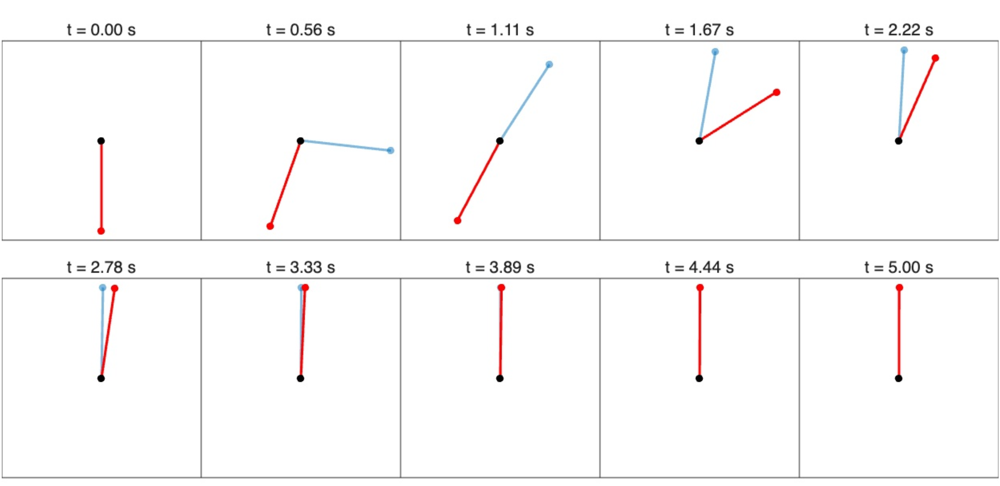

<div align="center">

# Safe Optimal Control using Log Barrier Constrained iLQR

**Abhijeet** and **Suman Chakravorty**

Texas A&M University, College Station, Texas, U.S.A.

</div>

---

<div align="center">

### [Manuscript (PDF)](Box_iLQR.pdf)   |   [MATLAB](https://github.com/abhinir/Box-iLQR/tree/main/Code/New-Code)   |   [Python](https://github.com/abhinir/Box-iLQR-Python)   |   [Video](#supplementary-video)   |   [Snapshots](#trajectory-comparison-using-snapshots)

</div>

---

## Abstract

Iterative Linear Quadratic Regulator (iLQR) and Differential Dynamic Programming (DDP) are attractive trajectory-optimization methods because their backward recursions provide both nominal trajectories and local time-varying feedback laws. Hard state and input constraints, however, can drive solutions toward constraint boundaries where little corrective authority remains during closed-loop execution.

This paper presents **Box-iLQR**, a log-barrier iLQR method for box-constrained states and controls, with emphasis on the resulting feedback policy. Barrier gradients bias nominal trajectories away from constraint boundaries, while barrier curvature enters the Riccati recursion that determines the feedback gains. We show that control-barrier curvature smoothly attenuates feedback as an actuator approaches saturation, while state-barrier curvature propagates backward through the value function to shape feedback before future state constraints are encountered.

This motivates retaining a finite barrier rather than always driving the barrier parameter toward zero, thereby preserving state and actuator margin. Comparisons with CL-DDP and ALTRO are presented on pendulum, cart-pole, Acrobot, and car-parking problems. Monte Carlo experiments demonstrate improved closed-loop behavior with finite barriers, while a six-input MuJoCo fish example demonstrates data-driven Box-iLQR using dynamics Jacobians estimated from simulator rollouts.

Box-iLQR achieves convergence comparable to, and in some cases better than, the baseline methods. Moreover, the feedback policy obtained with a finite barrier ensures constraint satisfaction even under execution uncertainty.

---

## Supplementary Video

<div align="center">

<a href="Videos/Box_iLQR_supplementary_video_compressed_HQ.mp4">
  
</a>

<br>

**[▶ Watch the Box-iLQR Supplementary Video](Videos/Box_iLQR_supplementary_video_compressed_HQ.mp4)**

<br>

<em>Click the image or the link above to watch the Box-iLQR supplementary video.</em>

</div>

---

## Trajectory Comparison using Snapshots

### Pendulum

<div align="center">



<br>

<em>Fig. 1: Time-lapse visualization of the pendulum swing-up task, comparing the unconstrained trajectory (light blue) against the constrained trajectory (red).</em>

</div>

---

### Cart-Pole

<div align="center">


<br>

<em>Fig. 2: Time-lapse visualization of the cart-pole swing-up task, comparing the unconstrained trajectory (light blue) against the trajectory with state and control constraints (red). Vertical dotted lines denote the state constraint -0.2 < x<sub>1</sub> < 0.2.</em>

</div>

---

### Acrobot

<div align="center">


<br>

<em>Fig. 3: Time-lapse visualization of the Acrobot swing-up task, comparing the unconstrained trajectory (light blue) against the constrained trajectory (red).</em>

</div>

---

## Citation

If you use our work, please cite our paper:

```bibtex
@misc{abhijeet2026boxilqr,
    title        = {Safe Optimal Control using Log Barrier Constrained iLQR},
    author       = {Abhijeet and Suman Chakravorty},
    year         = {2026},
    eprint       = {2602.05046},
    archivePrefix = {arXiv},
    primaryClass = {math.OC},
    url          = {https://arxiv.org/abs/2602.05046}
}
```
